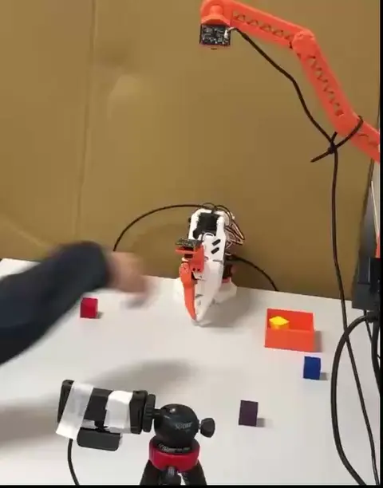

<h1 align="center">
Assessment and Failure Recovery in Remote Vision-Language-Action Deployment
</h1>

<h2 align="center">
From Pipeline Measurement to Proprioceptive Retry
</h2>

<p align="center">
<b>SmolVLA With FAR (failure recovery)</b>&nbsp;&nbsp;&nbsp;&nbsp;&nbsp;&nbsp;&nbsp;&nbsp;&nbsp;&nbsp;&nbsp;&nbsp;&nbsp;&nbsp;&nbsp;&nbsp;&nbsp;&nbsp;&nbsp;&nbsp;&nbsp;&nbsp;&nbsp;&nbsp;<b>SmolVLA Without FAR</b>
</p>

<p align="center">

</p>

<p align="center">
<b>Pi05 With FAR (failure recovery)</b>&nbsp;&nbsp;&nbsp;&nbsp;&nbsp;&nbsp;&nbsp;&nbsp;&nbsp;&nbsp;&nbsp;&nbsp;&nbsp;&nbsp;&nbsp;&nbsp;&nbsp;&nbsp;&nbsp;&nbsp;&nbsp;&nbsp;&nbsp;&nbsp;<b>Pi05 Without FAR</b>
</p>

<p align="center">

</p>

---

## About

This repository implements an experimental framework for **measuring, assessing, and recovering from failures** in remote VLA (Vision-Language-Action) deployments, built on top of [LeRobot](https://github.com/huggingface/lerobot) with the open-source [SO-101](https://huggingface.co/docs/lerobot/so101) robotic arm.

**Key contributions:**

- **Client–Server async inference**: Jetson Nano (edge) ↔ GPU server asynchronous policy execution, decoupling action prediction from robot control to eliminate inference-wait stalls.
- **Pipeline measurement**: End-to-end latency profiling across the async inference pipeline (observation queue, inference, action dispatch).
- **Failure detection & recovery**: Gripper-feedback state machine (proprioceptive monitoring) with automatic retry and recovery strategies on detected failures (empty grasp, slip, stall).
- **RTC integration**: Real-Time Chunking (RTC) for smooth chunk transitions with SmolVLA / Pi0.5 policies over the async transport.

**Supported policies:** SmolVLA, Pi0.5

**Hardware:** SO-101 follower arm + Jetson Nano 8G (client) + GPU workstation (server, H100)


> **Hardware & Checklist** → [docs/jetson-so101_hardware.md](docs/jetson-so101_hardware.md)  
> **Data Collection** → [docs/data_collection.md](docs/data_collection.md)  
> **Model Training** → [docs/training.md](docs/training.md)  
> **Client–Server Experiments** → [docs/so101_client-server.md](docs/so101_client-server.md)  
> **Experiments & Results** → [docs/experiments.md](docs/experiments.md)  

---

## Installation

This repository ships two `pyproject.toml` variants, selected by symlink:

```
pyproject_original.toml      ← standard server install (torch, torchvision, opencv included)
pyproject_jetson_nano.toml   ← Jetson install (torch/cv2/numpy provided by JetPack, stripped from deps)
pyproject.toml  →  pyproject_original.toml   (default symlink, tracked in git)
```

### Server (GPU workstation)

Requires Python ≥ 3.12. The default `pyproject.toml` symlink already points to `pyproject_original.toml`.

```bash
git clone <this-repo>
cd lerobot_far

# Verify symlink (should show pyproject_original.toml)
ls -la pyproject.toml

uv venv --python 3.12
source .venv/bin/activate

uv pip install -U pip setuptools wheel
uv pip install -e .

# Install extras as needed
uv pip install -e ".[async]"     # async inference (gRPC transport)
uv pip install -e ".[smolvla]"   # SmolVLA policy
uv pip install -e ".[pi]"        # Pi0.5 policy
```

### Client (Jetson Nano)

#### 1. Install jetson-containers

Follow the [jetson-containers setup guide](https://github.com/dusty-nv/jetson-containers/tree/master) on the Jetson host:

```bash
# On Jetson host
git clone https://github.com/dusty-nv/jetson-containers
cd jetson-containers
sudo apt-get update && sudo apt-get install -y python3-pip
pip3 install -r requirements.txt
```

#### 2. Switch pyproject symlink to the Jetson variant

On the **server / development machine** (before syncing to Jetson), or directly on Jetson:

```bash
cd lerobot_far
ln -sf pyproject_jetson_nano.toml pyproject.toml
# Verify
ls -la pyproject.toml   # should show → pyproject_jetson_nano.toml
```

The Jetson variant comments out `torch`, `torchvision`, `numpy`, `opencv-python-headless`, and `cmake` because JetPack provides GPU-optimised builds of these inside the container.

#### 3. Jetson udev rules (one-time setup)

Set persistent device names on the **Jetson host** so the arm and cameras always get the same path regardless of plug order. Do this before launching the container so the symlinks are visible inside it.

**Motor arms** — bind by USB serial ID:

```bash
# Find serial IDs (plug arms one at a time)
udevadm info -a -n /dev/ttyACM0 | grep serial

sudo tee /etc/udev/rules.d/99-so101.rules <<'EOF'
SUBSYSTEM=="tty", ATTRS{serial}=="<leader-serial>",   SYMLINK+="ttyACM_so101leader"
SUBSYSTEM=="tty", ATTRS{serial}=="<follower-serial>", SYMLINK+="ttyACM_so101follower"
EOF
```

**Cameras** — bind by USB port path (webcams have no unique serial):

```bash
# Find the ID_PATH for each camera (plug cameras one at a time)
udevadm info -q property -n /dev/video0 | grep -E 'ID_PATH|DEVPATH'

sudo tee /etc/udev/rules.d/99-webcam.rules <<'EOF'
# Top camera    (USB port 2.1)
SUBSYSTEM=="video4linux", ENV{ID_PATH}=="platform-3610000.usb-usb-0:2.1:1.0", ENV{ID_V4L_CAPABILITIES}==":capture:", SYMLINK+="videotop",   MODE="0666"
# Front camera  (USB port 2.4)
SUBSYSTEM=="video4linux", ENV{ID_PATH}=="platform-3610000.usb-usb-0:2.4:1.0", ENV{ID_V4L_CAPABILITIES}==":capture:", SYMLINK+="videofront", MODE="0666"
# Wrist camera  (USB port 1.3)
SUBSYSTEM=="video4linux", ENV{ID_PATH}=="platform-3610000.usb-usb-0:1.3:1.0", ENV{ID_V4L_CAPABILITIES}==":capture:", SYMLINK+="videowrist", MODE="0666"
EOF
```

> Adjust `ID_PATH` values to match your physical USB ports. Use `udevadm info -q property -n /dev/videoN | grep ID_PATH` to inspect each camera.

Apply and verify:

```bash
sudo udevadm control --reload-rules && sudo udevadm trigger

ll /dev/videotop /dev/videofront /dev/videowrist
ll /dev/ttyACM_so101leader /dev/ttyACM_so101follower

# Quick camera stream check
ffplay -f v4l2 -input_format mjpeg -video_size 800x600 -framerate 30 /dev/videotop
ffplay -f v4l2 -input_format mjpeg -video_size 640x480 -framerate 30 /dev/videofront
```

For full hardware setup details, see [docs/jetson-so101_hardware.md](docs/jetson-so101_hardware.md).

#### 4. Launch the container and install

> **Change paths to match your setup** — replace `/data/code/lerobot_far` with the actual path where you cloned this repo on the Jetson, and `/data/hf` with your HuggingFace cache directory.

```bash
# On Jetson host — launch (or re-attach to) the container
jetson-containers run -it \
  --name lerobot_far \
  -v /data/code/lerobot_far:/opt/lerobot \
  -v /data/hf:/data/hf \
  -e HF_HOME=/data/hf \
  -w /opt/lerobot \
  $(autotag lerobot)
```

Common container management commands:

```bash
# List running containers
docker ps

# Re-enter a running container (after detach or ssh reconnect)
docker exec -it lerobot_far /bin/bash

# List all containers (including stopped)
docker ps -a

# Stop / remove
docker stop lerobot_far
docker rm   lerobot_far

# Check GPU / JetPack inside container
python3 -c "import torch; print(torch.__version__, torch.cuda.is_available())"
```

Inside the container:

```bash
export PIP_INDEX_URL=https://pypi.org/simple
unset PIP_EXTRA_INDEX_URL
export HF_HOME=/data/hf

/opt/venv/bin/python3 -m pip install -U pip setuptools wheel
/opt/venv/bin/python3 -m pip install -e . --no-build-isolation
```

---

## Getting Started

### Quick Examples

The examples below use `smart_robot_client` — a drop-in replacement for `robot_client` that adds a **gripper-feedback state machine** for failure detection and recovery. Set `--enable_gripper_sm=false` to fall back to plain `RobotClient` behavior with zero overhead.

**State machine overview:**

```
policy outputs action_chunk
        ↓
  scan action queue  →  infer gripper phase
        ↓                 (APPROACHING / CLOSING / HOLDING / DROPPING / OPENING)
  bus.sync_read(Present_Load, ["gripper"])   ← ~1–2 ms, no camera
        ↓
  classify event
        ↓
  decide ─── CONTINUE    nominal path
           ├─ REINFER    drain queue + force re-inference (slip detected, empty gras)
           ├─ LIFT_RETRY lift arm + open + reinfer  (slip detected, empty gras, retry method)
           ├─ REWIND_RETRY replay actions in reverse + reinfer  (slip detected, empty gras, retry method)
           ├─ RECOVERY   go home + reinfer  (slip detected, empty gras, retry method)
           └─ STOP       too many retries
```

#### 1. Start the Policy Server (GPU workstation)

```bash
cd lerobot_far
export CUDA_VISIBLE_DEVICES=0

uv run python -m lerobot.async_inference.policy_server \
    --host=127.0.0.1 \
    --port=8080 \
    --fps=20
```

To expose the server to the Jetson over SSH tunnel:

```bash
# Run on Jetson — forwards local port 8080 to the server
ssh -J <gateway> <server-host> -L 8080:127.0.0.1:8080
```

| Parameter | Default | Description |
|-----------|---------|-------------|
| `--host` | `127.0.0.1` | Listen address (`0.0.0.0` for external access) |
| `--port` | `8080` | gRPC port |
| `--fps` | `30` | Target inference rate |
| `--inference_latency` | `0.033` | Minimum inference latency (s) |
| `--obs_queue_timeout` | `1` | Timeout waiting for observation (s) |

#### 2. Start the Robot Client (Jetson Nano)

**SmolVLA + NO RTC + gripper state machine:**

```bash
python -m lerobot.async_inference.smart_robot_client \
    --config_path "src/lerobot/async_inference/config/so101/async_client_sm.yaml" \
    --robot.type=so100_follower \
    --robot.port=/dev/ttyACM_so101follower \
    --robot.cameras="{
        top:   {type: opencv, index_or_path: '/dev/videotop',   width: 800, height: 600, fps: 30, backend: 200, fourcc: MJPG},
        wrist: {type: opencv, index_or_path: '/dev/videowrist', width: 800, height: 600, fps: 30, backend: 200, fourcc: MJPG},
        front: {type: opencv, index_or_path: '/dev/videofront', width: 640, height: 480, fps: 30, backend: 200, fourcc: MJPG}}" \
    --robot.id=cse_so101follower \
    --task="Pick up the yellow cube and put it into the orange box." \
    --server_address=127.0.0.1:8080 \
    --policy_type=smolvla \
    --pretrained_name_or_path=jadenovalight/smolvla_pick-place_v2.4 \
    --policy_device=cuda \
    --client_device=cpu \
    --actions_per_chunk=50 \
    --chunk_size_threshold=0.5 \
    --aggregate_fn_name=latest_only \
    --fps=20 \
    --enable_gripper_sm=true \
    --max_empty_grasp_retries=3 \
    --obs_image_use_model_resize=true \
    --obs_image_resize_hw="{'top': [480, 640], 'wrist': [480, 640], 'front': [480, 640]}" \
    --obs_image_jpeg_quality=85
```

**Pi0.5 + RTC + gripper state machine:**

```bash
python -m lerobot.async_inference.smart_robot_client \
    --config_path "src/lerobot/async_inference/config/so101/async_client_sm.yaml" \
    --robot.type=so100_follower \
    --robot.port=/dev/ttyACM_so101follower \
    --robot.cameras="{
        top:   {type: opencv, index_or_path: '/dev/videotop',   width: 800, height: 600, fps: 30, backend: 200, fourcc: MJPG},
        wrist: {type: opencv, index_or_path: '/dev/videowrist', width: 800, height: 600, fps: 30, backend: 200, fourcc: MJPG},
        front: {type: opencv, index_or_path: '/dev/videofront', width: 640, height: 480, fps: 30, backend: 200, fourcc: MJPG}}" \
    --robot.id=cse_so101follower \
    --task="Pick up the yellow cube and put it into the orange box." \
    --server_address=127.0.0.1:8080 \
    --policy_type=pi05 \
    --pretrained_name_or_path=HollyTan/pi05_so101_pick_place-v2.4basev2.2_abs_nofreeze_8b \
    --policy_device=cuda \
    --client_device=cuda \
    --obs_image_use_model_resize=true \
    --obs_image_resize_hw="{top: [224, 224], wrist: [224, 224], front: [224, 224]}" \
    --obs_image_jpeg_quality=85 \
    --actions_per_chunk=50 \
    --chunk_size_threshold=0.5 \
    --aggregate_fn_name=latest_only \
    --fps=20 \
    --rtc_execution_horizon=20 \
    --enable_gripper_sm=true \
    --max_empty_grasp_retries=3 \
```

Key client parameters:

| Parameter | Description |
|-----------|-------------|
| `--fps` | Control loop rate — must match server `--fps` |
| `--actions_per_chunk` | Number of actions per inference chunk |
| `--chunk_size_threshold` | Queue depth ratio to trigger next observation request |
| `--aggregate_fn_name` | Chunk overlap aggregation: `latest_only` or `weighted_average` |
| `--interpolation_multiplier` | Motor control upsampling (1=off, 2–3=recommended); effective rate = `fps × multiplier` |
| `--rtc_execution_horizon` | RTC replanning window in steps (0=off, 20=recommended; SmolVLA/Pi0.5 only) |
| `--enable_gripper_sm` | Enable gripper state machine (`true` / `false`) |
| `--gripper_load_grasp_threshold` | Load threshold (raw units) to confirm a grasp |
| `--max_empty_grasp_retries` | Max retries before STOP |

> **Note:** `server --fps` and `client --fps` must match.

For full experiment commands see [docs/so101_client-server.md](docs/so101_client-server.md).

---

## TODO

- [ ] Proprioceptive failure detector: stall / collision / drop detection

---

## Acknowledgments

- [LeRobot](https://github.com/huggingface/lerobot) — Hugging Face's real-world robotics library; this project extends its async inference infrastructure.
- [SO-101](https://huggingface.co/docs/lerobot/so101) — Low-cost open-source robot arm by Hugging Face.
- [jetson-containers](https://github.com/dusty-nv/jetson-containers) — NVIDIA Jetson ML container build system.
- [SmolVLA](https://huggingface.co/papers/2506.01844) — Compact VLA model from Hugging Face.
- [π₀ / π₀.₅](https://www.physicalintelligence.company/blog/pi0) — Flow-matching VLA models from Physical Intelligence (pi0 / pi05 in this codebase).
- [LIBERO](https://github.com/Lifelong-Robot-Learning/LIBERO) — Lifelong robot learning benchmark suite used for simulation evaluation.
- [RTC (Real-Time Chunking)](docs/source/rtc.mdx) — Smooth async chunk execution for flow-matching policies.
- Parts of this documentation and code were written with the assistance of [Claude Code](https://claude.ai/code) (Anthropic).

---

## License

This project is licensed under the Apache 2.0 License — see [LICENSE](LICENSE) for details.
