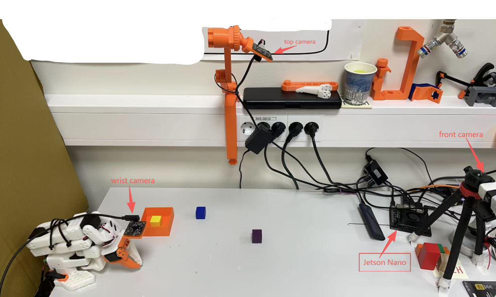
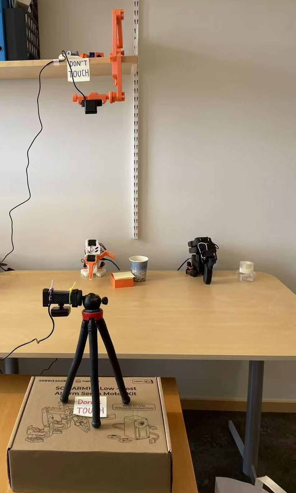
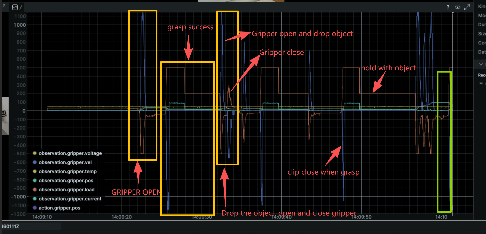
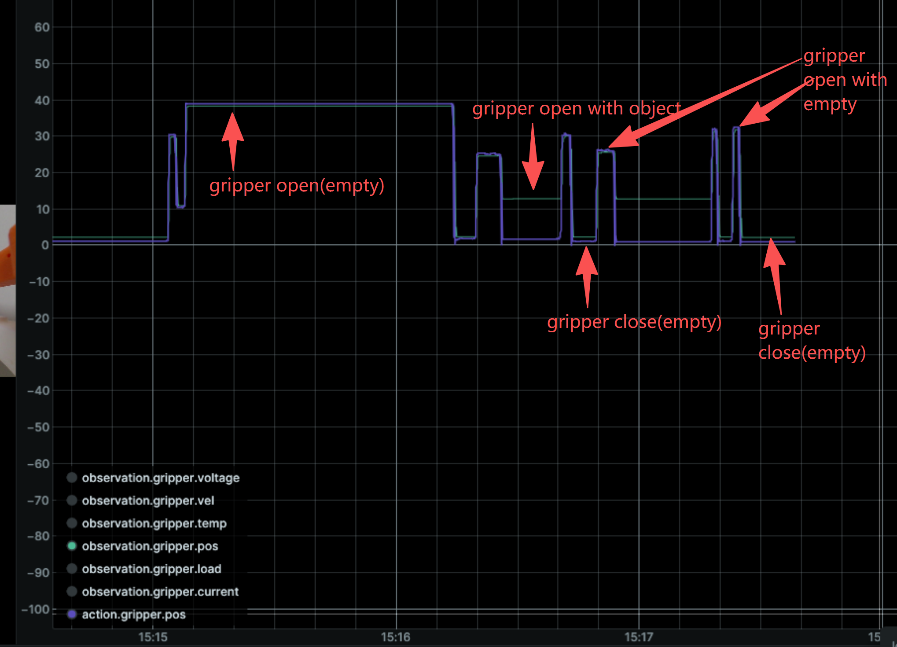

# Jetson Nano + SO-101 Hardware Setup

← [Back to README](../README.md)

References:
- [jetson-containers](https://github.com/dusty-nv/jetson-containers/tree/master)
- [jetson-containers lerobot package](https://github.com/dusty-nv/jetson-containers/tree/master/packages/physicalAI/lerobot)
- [LeRobot SO-101 guide](https://huggingface.co/docs/lerobot/so101)

---

## 1. udev Rules (one-time setup, on Jetson host)

Must be set on the host before launching the container so symlinks are visible inside it.

### Motor arms — bind by USB serial ID

Plug arms one at a time and find their serial IDs:

```bash
ll /dev/serial/by-id/
udevadm info -a -n /dev/ttyACM0 | grep serial
udevadm info -a -n /dev/ttyACM1 | grep serial
```

Create the rules file (replace serial values with your hardware):

```bash
sudo tee /etc/udev/rules.d/99-so101.rules <<'EOF'
SUBSYSTEM=="tty", ATTRS{serial}=="5AB9067356", SYMLINK+="ttyACM_so101leader"
SUBSYSTEM=="tty", ATTRS{serial}=="5AB9067974", SYMLINK+="ttyACM_so101follower"
EOF
```

### Cameras — bind by USB port path

Webcams have no unique serial number, so they are bound by physical USB port. The port assignments differ between environments.

Find the `ID_PATH` for each camera (plug one at a time):

```bash
udevadm info -q property -n /dev/video0 | grep -E 'ID_PATH|DEVPATH|ID_SERIAL'
udevadm info -q property -n /dev/video2 | grep -E 'ID_PATH|DEVPATH|ID_SERIAL'

# List all video devices and their USB port
v4l2-ctl --list-devices
```

#### Lab setup


```bash
sudo tee /etc/udev/rules.d/99-webcam.rules <<'EOF'
# Top camera   (USB port 2.1)
SUBSYSTEM=="video4linux", ENV{ID_PATH}=="platform-3610000.usb-usb-0:2.1:1.0", ENV{ID_V4L_CAPABILITIES}==":capture:", SYMLINK+="videotop",   MODE="0666"
# Front camera (USB port 2.4)
SUBSYSTEM=="video4linux", ENV{ID_PATH}=="platform-3610000.usb-usb-0:2.4:1.0", ENV{ID_V4L_CAPABILITIES}==":capture:", SYMLINK+="videofront", MODE="0666"
# Wrist camera (USB port 1.3)
SUBSYSTEM=="video4linux", ENV{ID_PATH}=="platform-3610000.usb-usb-0:1.3:1.0", ENV{ID_V4L_CAPABILITIES}==":capture:", SYMLINK+="videowrist", MODE="0666"
EOF
```

Reference — lab `v4l2-ctl --list-devices` output:
```
Web Camera: Web Camera (usb-3610000.usb-2.1):  → /dev/video*  (top)
Web Camera: Web Camera (usb-3610000.usb-2.4):  → /dev/video*  (front)
```

#### Office setup


```bash
sudo tee /etc/udev/rules.d/99-webcam.rules <<'EOF'
# Top camera   (USB port 2.3)
SUBSYSTEM=="video4linux", ENV{ID_PATH}=="platform-3610000.usb-usb-0:2.3:1.0", ENV{ID_V4L_CAPABILITIES}==":capture:", SYMLINK+="videotop",   MODE="0666"
# Front camera (USB port 2.1)
SUBSYSTEM=="video4linux", ENV{ID_PATH}=="platform-3610000.usb-usb-0:2.1:1.0", ENV{ID_V4L_CAPABILITIES}==":capture:", SYMLINK+="videofront", MODE="0666"
EOF
```

Reference — office `v4l2-ctl --list-devices` output:
```
NVIDIA Tegra Video Input Device (platform:tegra-camrtc-ca):  → /dev/media0
Web Camera: Web Camera (usb-3610000.usb-2.1):                → /dev/video2, /dev/video3, /dev/media2
Web Camera: Web Camera (usb-3610000.usb-2.3):                → /dev/video0, /dev/video1, /dev/media1
```

> The office setup has no wrist camera; comment out or remove the `videowrist` rule accordingly.

### Apply and verify

```bash
sudo udevadm control --reload-rules && sudo udevadm trigger

ll /dev/videotop /dev/videofront         # lab: also /dev/videowrist
ll /dev/ttyACM_so101leader /dev/ttyACM_so101follower
```

### Camera stream check

```bash
sudo apt install -y v4l-utils ffmpeg
v4l2-ctl --list-devices
v4l2-ctl --device=/dev/videotop --list-formats-ext   # check resolution / fps

# Quick preview
ffplay -f v4l2 -input_format mjpeg -video_size 800x600  -framerate 30 /dev/videotop
ffplay -f v4l2 -input_format mjpeg -video_size 640x480  -framerate 30 /dev/videofront
ffplay -f v4l2 -input_format mjpeg -video_size 1280x1024 -framerate 30 /dev/videowrist  # lab only
```

---

## 2. Motor Calibration
> **so101 Calibration** → [https://huggingface.co/docs/lerobot/so101](https://huggingface.co/docs/lerobot/so101) 

```bash
sudo chmod 666 /dev/ttyACM_so101follower /dev/ttyACM_so101leader

lerobot-calibrate \
    --robot.type=so101_follower \
    --robot.port=/dev/ttyACM_so101follower \
    --robot.id=cse_so101follower

lerobot-calibrate \
    --teleop.type=so101_leader \
    --teleop.port=/dev/ttyACM_so101leader \
    --teleop.id=cse_so101_leader
```

Calibration files are saved to:
- `~/.cache/huggingface/lerobot/calibration/robots/so_follower/cse_so101follower.json`
- `~/.cache/huggingface/lerobot/calibration/teleoperators/so_leader/cse_so101_leader.json`

In this project, we can use the calibration files that we already have in:
> **so101 Calibration Files** → [docs/so101_hardware_setup/calibration](docs/so101_hardware_setup/calibration) 

Check cameras before calibrating:
```bash
lerobot-find-cameras opencv
```

---

## 3. Launch Container

> **Change paths** — replace `/data/code/lerobot_far` and `/data/hf` with your own paths.

```bash
jetson-containers run -it \
  --name lerobot_far \
  -v /data/code/lerobot_far:/opt/lerobot \
  -v /data/hf:/data/hf \
  -e HF_HOME=/data/hf \
  -w /opt/lerobot \
  $(autotag lerobot)
```

Common container commands:

```bash
docker ps                                    # list running containers
docker exec -it lerobot_far /bin/bash        # re-enter after detach / ssh reconnect
docker ps -a                                 # list all (including stopped)
docker stop lerobot_far && docker rm lerobot_far
```

### Install inside container

```bash
export PIP_INDEX_URL=https://pypi.org/simple
unset PIP_EXTRA_INDEX_URL
export HF_HOME=/data/hf

/opt/venv/bin/python3 -m pip install -U pip setuptools wheel
/opt/venv/bin/python3 -m pip install -e . --no-build-isolation
```

### Verify installation

```bash
python3 -c "import torch; print(torch.__version__, torch.cuda.is_available())"
python3 -c "import cv2; print(cv2.__file__)"
python3 -c "import transformers; print(transformers.__version__)"
python3 -c "import lerobot; print(lerobot.__file__)"
command -v lerobot-find-port
```

---

## 4. Teleoperate

**Lab** (top + wrist + front):

```bash
lerobot-teleoperate \
    --robot.type=so101_follower \
    --robot.port=/dev/ttyACM_so101follower \
    --robot.id=cse_so101follower \
    --robot.cameras="{
        top:   {type: opencv, index_or_path: '/dev/videotop',   width: 800, height: 600, fps: 30, backend: 200, fourcc: MJPG},
        wrist: {type: opencv, index_or_path: '/dev/videowrist', width: 800, height: 600, fps: 30, backend: 200, fourcc: MJPG},
        front: {type: opencv, index_or_path: '/dev/videofront', width: 640, height: 480, fps: 30, backend: 200, fourcc: MJPG}}" \
    --teleop.type=so101_leader \
    --teleop.port=/dev/ttyACM_so101leader \
    --teleop.id=cse_so101_leader \
    --display_data=true \
    --display_async=true \
    --display_image_interval_s=0.5
```

**Office** (top + front, no wrist):

```bash
lerobot-teleoperate \
    --robot.type=so101_follower \
    --robot.port=/dev/ttyACM_so101follower \
    --robot.id=cse_so101follower \
    --robot.cameras="{
        top:   {type: opencv, index_or_path: '/dev/videotop',   width: 640, height: 480, fps: 30, backend: 200, fourcc: MJPG},
        front: {type: opencv, index_or_path: '/dev/videofront', width: 640, height: 480, fps: 30, backend: 200, fourcc: MJPG}}" \
    --teleop.type=so101_leader \
    --teleop.port=/dev/ttyACM_so101leader \
    --teleop.id=cse_so101_leader \
    --display_data=true \
    --display_compressed_images=true \
    --display_image_interval_s=0.5
```

### Motor feedback monitoring during teleoperation

By default `lerobot-teleoperate` reads and displays only `Present_Position` for all 6 motors. To additionally stream **load and current** for specific motors in Rerun (useful for characterising gripper contact forces before tuning the state machine), add `--robot.record_motor_state`:

```bash
lerobot-teleoperate \
    --robot.type=so101_follower \
    --robot.port=/dev/ttyACM_so101follower \
    --robot.id=cse_so101follower \
    --robot.cameras="{
        top:   {type: opencv, index_or_path: '/dev/videotop',   width: 800, height: 600, fps: 30, backend: 200, fourcc: MJPG},
        wrist: {type: opencv, index_or_path: '/dev/videowrist', width: 800, height: 600, fps: 30, backend: 200, fourcc: MJPG},
        front: {type: opencv, index_or_path: '/dev/videofront', width: 640, height: 480, fps: 30, backend: 200, fourcc: MJPG}}" \
    --teleop.type=so101_leader \
    --teleop.port=/dev/ttyACM_so101leader \
    --teleop.id=cse_so101_leader \
    --display_data=true \
    --display_async=true \
    --display_image_interval_s=0.5 \
    --robot.record_motor_state='["gripper"]'
```

What this adds per control step (2 extra `sync_read` calls, ~2–4 ms total):

| Channel in Rerun | Register | Description |
|-----------------|----------|-------------|
| `gripper/load` | `Present_Load` (addr 60–61) | Torque load on gripper (raw units, signed) |
| `gripper/current` | `Present_Current` | Motor winding current |

To monitor multiple motors:
```bash
--robot.record_motor_state='["gripper", "wrist_roll"]'
```

> **Why this matters for the state machine:** The load profile during a grasp attempt is the primary signal used by `GripperStateMonitor` to distinguish grasp phases. Observing it here during teleoperation lets you determine appropriate thresholds for `--gripper_load_grasp_threshold` before deployment.

---

## 5. Motor Feedback and State Machine Basis

### Register map (STS3215 continuous block)

```
addr 56–57  Present_Position   (2 B)  ┐
addr 58–59  Present_Velocity   (2 B)  │  8-byte contiguous block — one sync_read
addr 60–61  Present_Load       (2 B)  │
addr 62     Present_Voltage    (1 B)  │
addr 63     Present_Temperature(1 B)  ┘
addr 64     ← undefined
```

### Two independent read paths in SmartRobotClient

`smart_robot_client` intentionally separates the inference observation path from the state machine feedback path to avoid dimension mismatches and latency bloat:

| Path | What is read | Frequency | Cost |
|------|-------------|-----------|------|
| **Inference path** | `Present_Position` (all 6 motors) + camera frames | Every control step | ~10–33 ms (camera-dominated) |
| **SM feedback path** | `Present_Load` (gripper only) | Every control step | ~1–2 ms, no camera |

The SM feedback path uses `bus.sync_read(register, motor_names)` directly — it does **not** go through `get_observation()` and its result is never included in the observation tensor sent to the server. This avoids:
- Action tensor dimension mismatch (`_action_tensor_to_action_dict` maps by index)
- Policy normaliser dimension mismatch (server-side)
- Camera capture overhead (~10–33 ms per call) on every step

### Gripper phase lifecycle

```
APPROACHING → CLOSING → HOLDING → DROPPING → OPENING
                           ↑
                        slip / empty grasp detected here
                        (load drops unexpectedly while phase is still HOLDING)
```

Phase is inferred from a **lookahead scan of the action queue** (upcoming gripper position commands), not from the current observation. This means the SM can anticipate a grasp attempt one chunk ahead and arm the load-threshold detector before the gripper physically closes.

### Load threshold calibration

The key threshold is `--gripper_load_grasp_threshold` (raw `Present_Load` units). To calibrate:

1. Run teleoperation with `--robot.record_motor_state='["gripper"]'` and observe the `gripper/load` channel in Rerun across several successful grasps and empty-grasp attempts.
2. Choose a threshold between the empty-grasp peak (low load, typically < 40) and the successful-grasp sustained load (typically 80–150 depending on object weight).
3. Pass the value as `--gripper_load_grasp_threshold=<value>` to `smart_robot_client`.

### Acceleration and Goal_Velocity

Motor bus registers written on every `connect()`:

| Register | addr | Value | Effect |
|----------|------|-------|--------|
| `Return_Delay_Time` | 9 | 0 | Minimum response delay (2 µs) |
| `Maximum_Acceleration` | 85 | 254 | Max acceleration limit |
| `Acceleration` | 41 | 254 | Acceleration profile — maximum |
| `Operating_Mode` | 33 | 0 | Position servo mode |
| `P/I/D_Coefficient` | — | 16/0/32 | PID gains |

`Goal_Velocity` (addr 46) and `Goal_Time` (addr 44) are **not** written — they retain the EEPROM default (`Goal_Velocity=0` = no speed limit).

**Critical rule:** `Acceleration` and `Goal_Velocity` must be identical between data collection and inference. A mismatch creates distribution shift — the policy's learned action→outcome mapping becomes invalid at deployment.

If modifying either register, write it explicitly in `configure()` so state is reproducible across sessions. Setting a `Goal_Velocity` limit reduces overshoot/oscillation and lowers `Present_Load` / `Present_Current` peaks — relevant if these signals are used as SM observations.

> **Gripper Motor Feedback** → [docs/so101_hardware_setup/so101_motor_feedback](docs/so101_hardware_setup/so101_motor_feedback) 

